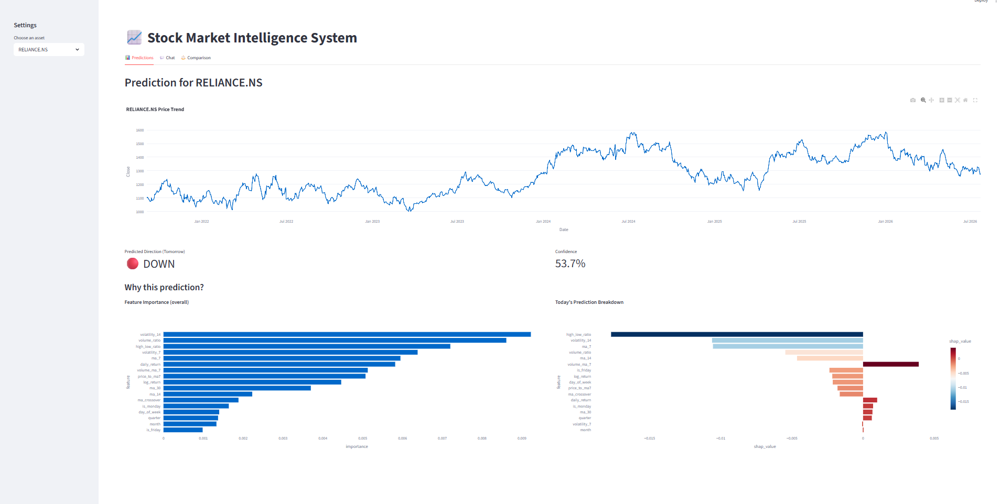
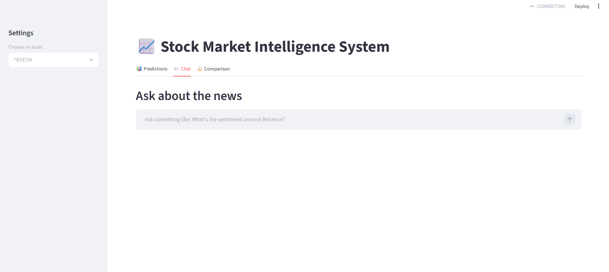
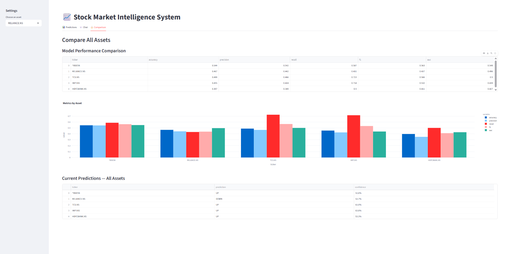

# 📈 Stock Market Intelligence System

An end-to-end machine learning system that predicts next-day stock direction for major Indian market assets, explains its predictions with SHAP, and answers natural-language questions about market news through a Retrieval-Augmented Generation (RAG) pipeline, all wrapped in an interactive Streamlit application.

Built as a capstone project simulating the role of a data scientist at a quantitative investment firm.

---

## 🎯 Overview

This system combines classical ML with modern LLM techniques to deliver a full investment-research workflow:

- **Predict** : Random Forest classifiers forecast next-day UP/DOWN movement for 5 assets
- **Explain** : SHAP values break down *why* the model made each prediction, both globally and per-prediction
- **Ask** : A RAG pipeline answers natural-language questions about recent market news, grounded in real retrieved articles
- **Compare** : Side-by-side performance metrics across all assets

It can answer questions like:
> *"What is the predicted direction for Reliance tomorrow?"*
> *"Which stock has the highest accuracy?"*
> *"Explain why Sensex is predicted to go UP."*
> *"Compare the performance of TCS and Infosys."*

---

## 🏗️ Architecture

- **Data Layer** - yfinance (5yr price history) + NewsAPI (headlines)
- **Feature Engineering** - 23 engineered features (returns, moving averages, volatility, volume, time-based signals)
- **Modeling** - Random Forest classifiers, one per asset, time-based train/test split (no lookahead bias)
- **Explainability** - SHAP TreeExplainer (global + per-prediction)
- **Retrieval** - Sentence Transformers (MiniLM) embeddings → ChromaDB
- **Generation** - Cohere Command chat model, grounded on retrieved articles
- **Interface** - Streamlit (3-tab web app)

---

## ✨ Features

| Tab | What it does |
|---|---|
| 📊 **Predictions** | Price trend chart, next-day UP/DOWN prediction with confidence, SHAP feature importance, and a per-prediction breakdown |
| 💬 **Chat** | Ask questions about recent news; answers are generated only from retrieved articles, not the model's general knowledge |
| ⚖️ **Comparison** | Accuracy, precision, recall, F1, and AUC across all 5 assets, plus current predictions for each |

---

## 🛠️ Tech Stack

**Data & ML:** Python, pandas, NumPy, scikit-learn, yfinance
**Explainability:** SHAP
**RAG:** Sentence Transformers, ChromaDB, Cohere
**Visualization:** Plotly
**App:** Streamlit

---

## 📊 Key Findings

- Of the 5 assets modeled, only **Sensex** showed AUC meaningfully above random chance (0.548) - individual stocks (Reliance, TCS, Infosys, HDFC Bank) hovered at or below random (AUC 0.43–0.50). This reflects a well-documented reality in quantitative finance: short-horizon direction prediction from price/technical features alone is close to an efficient-market problem, and predicting a broad index (which averages out single-stock noise) is comparatively easier than predicting any one stock.
- **Threshold tuning** based on asymmetric business costs (false positives costing more than false negatives) reduced total cost across all 5 assets, with savings ranging from ₹2,450 to ₹6,950 depending on the asset - every optimal threshold landed well above the default 0.5, meaning the model needed higher confidence before "acting" on an UP call.
- SHAP analysis showed **recent trading volume (`volume_ma_7`)** was consistently the most influential feature across assets, followed by moving-average-based mean-reversion signals - while calendar effects (day-of-week, month) contributed negligibly.

---

## 🚀 Setup

Clone the repo and install dependencies:

    git clone https://github.com/Kripa-Garg/stock-intelligence-app.git
    cd stock-intelligence-app
    pip install -r requirements.txt

Create `.streamlit/secrets.toml` with your own Cohere key:

    COHERE_API_KEY = "your_key_here"

Run the app:

    streamlit run app.py

---

## 📸 Screenshots

**Predictions Tab**

**Chat Tab**

**Comparison Tab**

---

## 📁 Project Structure

- `app.py` - Streamlit application
- `data_*.csv` - 5 years of historical price data per asset
- `model_*.pkl` - Trained Random Forest pipelines per asset
- `news_data.csv` - Collected news headlines
- `requirements.txt` - Python dependencies
- `notebooks/Capstone.ipynb` - Full analysis: EDA, feature engineering, modeling, SHAP, RAG pipeline development
- `screenshots/` - App screenshots used in this README
- `README.md` - This file

---

## 🔮 Possible Extensions

- Incorporate sentiment scores from news headlines as model features
- Backtest a simple trading strategy using the tuned thresholds
- Add LSTM/time-series-specific models for comparison against Random Forest
- Expand news coverage beyond NewsAPI's free-tier 1-month window

---

## 👤 Author

**Kripa**
Built for the Cambridgeshire Career Academy Capstone Project
